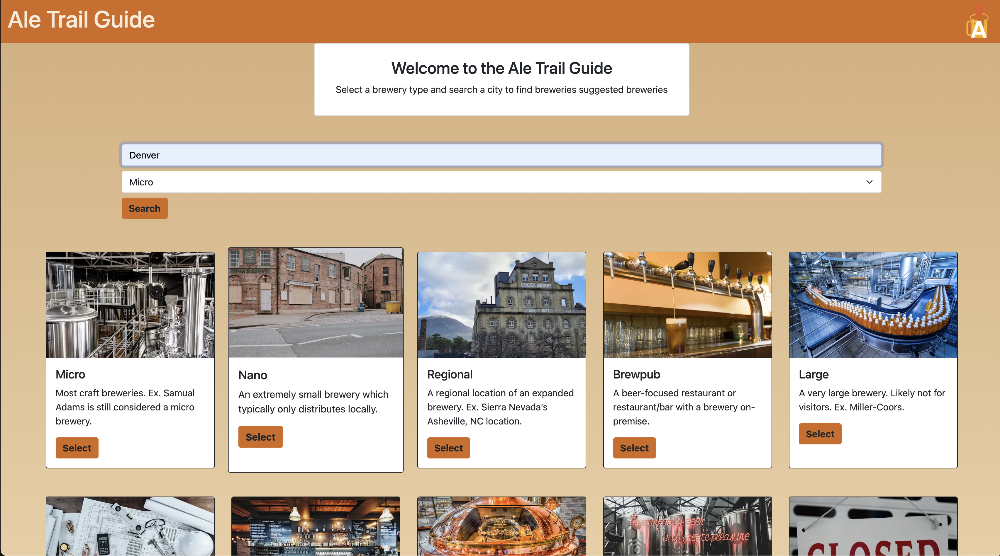
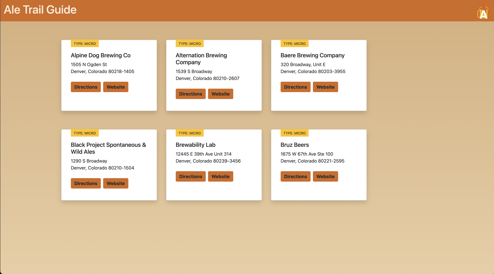
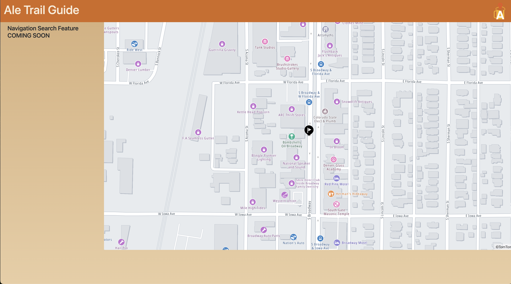

# Ale Trail Guide

Welcome to the Ale Trail Guide, a web application for exploring breweries!

## Overview

The Ale Trail Guide is designed to help users discover and explore different types of breweries in various locations. Whether you're a craft beer enthusiast or looking for a new place to visit, this guide has you covered.

## Features

- **Brewery Types:** Choose from a variety of brewery types, including Microbreweries, Nanobreweries, Regional Breweries, and more.
- **Search:** Find breweries based on location or specific criteria.
- **Card View:** Browse breweries results in a card view, each representing a unique brewery.
- **Interactive Map:** Visualize brewery locations on an interactive map for easy navigation.

## Technologies Used

- **HTML:**
- **CSS:**
- **JavaScript:**

## Library's Used

- **Bootstrap:**
- **JQuery:**

## Screenshots

## Contributors

- **Daniel Goss**
- **Aaron Lyman**
- **Gabe Latimer**
- **Chance Creger**

## License

This project is licensed under the [MIT License](LICENSE).
